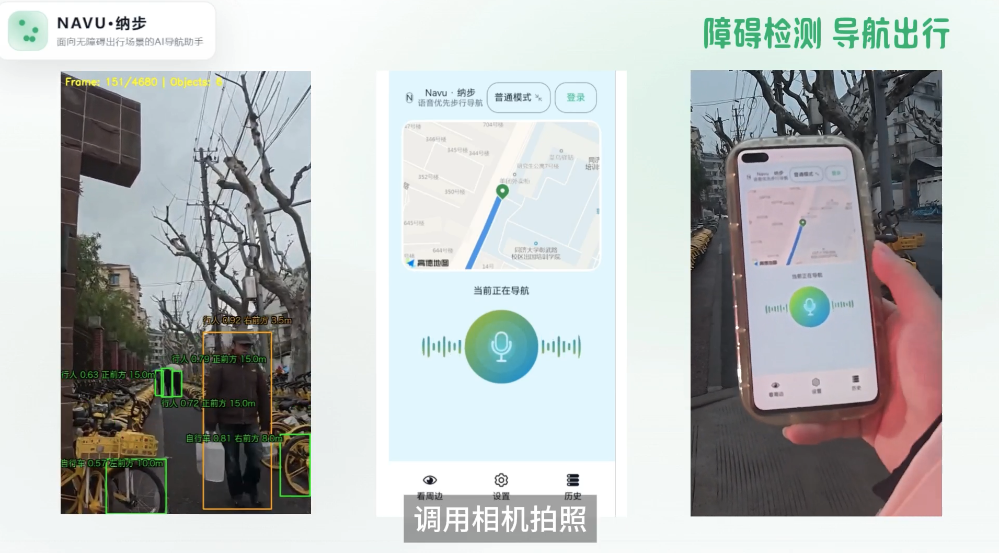
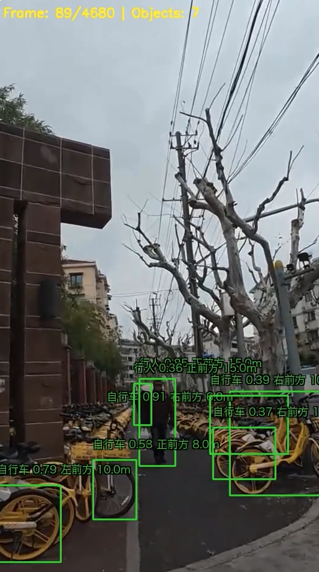
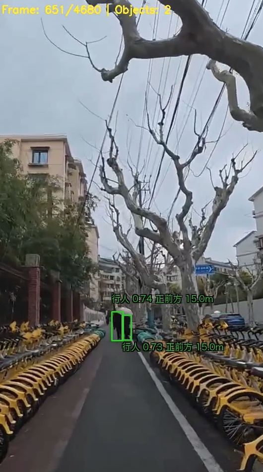

# 🧭 无障碍导航后端系统

**基于 AI 的智能无障碍导航解决方案**

[](https://www.python.org)
[](https://fastapi.tiangolo.com)
[](LICENSE)
[](https://github.com/yourusername/yourrepo)

[功能特性](#-核心功能) • [快速开始](#-快速开始) • [视频演示](#-视频演示) • [API文档](./API.md)


---

## 📖 项目简介

无障碍导航后端系统是一个为视障人士设计的智能导航解决方案，整合了语音交互、AI 视觉识别和实时导航功能，提供安全、便捷的出行体验。

**高德开发者竞赛参赛作品** | 项目协作者：[@luoxinlan322-sudo](https://github.com/luoxinlan322-sudo)

---

## ✨ 核心功能

<table>
  <tr>
    <td align="center" width="25%">
      <br>
      🗣️
      <br><br>
      <b>语音交互</b>
      <br><br>
      自然语言导航<br>支持语音合成与识别
      <br><br>
    </td>
    <td align="center" width="25%">
      <br>
      🎯
      <br><br>
      <b>智能导航</b>
      <br><br>
      集成高德地图API<br>精准路线规划
      <br><br>
    </td>
    <td align="center" width="25%">
      <br>
      👁️
      <br><br>
      <b>障碍物检测</b>
      <br><br>
      基于YOLO的<br>实时物体识别
      <br><br>
    </td>
    <td align="center" width="25%">
      <br>
      🤖
      <br><br>
      <b>AI助手</b>
      <br><br>
      大模型驱动的<br>对话式交互
      <br><br>
    </td>
  </tr>
</table>

---

## 🎬 视频演示

<table>
  <tr>
    <th width="30%">演示内容</th>
    <th width="40%">预览</th>
    <th width="30%">链接</th>
  </tr>
  <tr>
    <td><b>完整功能演示</b><br><small>展示系统完整流程</small></td>
    <td align="center"></td>
    <td align="center"><a href="https://www.bilibili.com/video/BV1horYBmEiP/"></a></td>
  </tr>
  <tr>
    <td><b>识别效果展示</b><br><small>YOLO 实时检测效果</small></td>
    <td align="center">
      
      
    </td>
    <td align="center"><a href="https://www.bilibili.com/video/BV1aorYBmEAx/"></a></td>
  </tr>
</table>

---

## 🚀 快速开始

### 📋 环境要求

- Python 3.8 或更高版本
- pip 包管理器
- （可选）支持 CUDA 的 GPU 用于 YOLO 加速

### 📦 1. 安装依赖

```bash
# 更新 pip
pip install -U pip

# 安装基础依赖
pip install -r requirements.txt
```

**可选：启用 YOLO 识别**

根据硬件条件选择安装（二选一）：

<details>
<summary>💻 CPU 版本</summary>

```bash
pip install -r requirements-yolo-cpu.txt
```
</details>

<details>
<summary>🚀 GPU 版本（推荐）</summary>

```bash
# CUDA 11.8 示例
pip install -r requirements-yolo-gpu-cu118.txt
```
</details>

### ⚙️ 2. 配置环境变量

```bash
# 复制配置模板
cp .env.example .env
```

编辑 `.env` 文件：

```env
# 必填配置
LLM_API_KEY=your_deepseek_api_key      # DeepSeek API 密钥
AMAP_API_KEY=your_amap_api_key         # 高德地图 API 密钥

# 可选配置
MOCK_MODE=false                         # 是否启用模拟模式
```

> 💡 **提示**：
> - [获取 DeepSeek API Key](https://platform.deepseek.com/)
> - [获取高德地图 API Key](https://lbs.amap.com/)

### ▶️ 3. 启动服务

```bash
uvicorn main:app --host 0.0.0.0 --port 8000
```

**服务地址：**

| 服务 | 地址 | 说明 |
|------|------|------|
| 🌐 主服务 | http://127.0.0.1:8000 | API 服务入口 |
| 📖 API 文档 | http://127.0.0.1:8000/docs | Swagger 交互式文档 |
| 📋 ReDoc 文档 | http://127.0.0.1:8000/redoc | 替代文档界面 |

---

## 🏗️ 技术架构

### 技术栈

```
前端通信：WebSocket + REST API
语音处理：TTS (Text-to-Speech)
视觉识别：YOLOv8
AI 对话：DeepSeek LLM
地图服务：高德地图 API
后端框架：FastAPI + Python
```

### 项目结构

<details>
<summary>点击展开完整目录树</summary>

```
accessible-nav-backend/
├── 📄 main.py                      # 应用入口
├── 📄 API.md                       # API接口文档
├── 📄 requirements.txt             # 基础依赖
├── 📄 requirements-yolo-*.txt      # YOLO依赖配置
├── 🔒 .env                         # 环境配置（需自行创建）
├── 📋 .env.example                 # 配置模板
│
├── 📂 app/
│   ├── 📂 api/                     # API路由层
│   │   ├── voice_routes.py         # 语音交互接口
│   │   └── nav_routes.py           # 导航服务接口
│   │
│   ├── 📂 services/                # 业务逻辑层
│   │   ├── tts_service.py          # 文字转语音服务
│   │   ├── yolo_service.py         # 障碍物识别服务
│   │   ├── llm_service.py          # 大模型对话服务
│   │   └── amap_service.py         # 高德地图服务
│   │
│   ├── 📂 core/                    # 核心功能模块
│   │   ├── session_manager.py      # 会话管理器
│   │   └── websocket_manager.py    # WebSocket管理器
│   │
│   └── 📂 models/                  # 数据模型
│       └── schemas.py              # Pydantic数据模型
│
├── 📂 config/                      # 配置文件
│   └── settings.py                 # 系统配置管理
│
└── 📂 tests/                       # 测试文件
    ├── test_frontend.py            # 前端测试脚本
    └── test.ipynb                  # 快速测试 Notebook
```
</details>

---

## 🧪 测试与开发

### 快速测试

使用 Jupyter Notebook 进行功能测试：

```bash
jupyter notebook tests/test.ipynb
```

### 运行测试脚本

```bash
python tests/test_frontend.py
```

---

## 📚 文档导航

| 文档 | 说明 |
|------|------|
| [API 接口文档](./API.md) | 详细的 API 端点说明 |
| [配置指南](./.env.example) | 环境变量配置说明 |
| [开发规范](./docs/development.md) | 代码规范和贡献指南 |

---

## 🤝 参与贡献

我们欢迎所有形式的贡献！

- 🐛 [提交 Bug](../../issues/new?template=bug_report.md)
- 💡 [功能建议](../../issues/new?template=feature_request.md)
- 📝 提交 Pull Request

---

## 📄 开源协议

本项目基于 [MIT License](LICENSE) 开源。

---

## 🌟 支持项目

如果这个项目对你有帮助，请给我们一个 ⭐️ Star！

<div align="center">

**用 ❤️ 打造无障碍导航体验**

[⬆ 回到顶部](#-无障碍导航后端系统)
